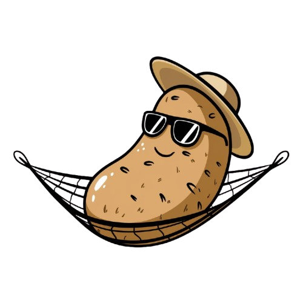

<div align="center">

# Grosse Patate

##### Burn less calories when coding

[](http://www.lua.org)
[](https://neovim.io)
[](https://nodejs.org)



</div>

## Installation

- install using `lazy.nvim`:

```lua
{
  "ArielBenichou/grosse-patate.nvim",
  dependencies = {
    "jose-elias-alvarez/null-ls.nvim",
  },
  build = "cd engine && npm install",
  config = function()
    require("grosse-patate").setup()
  end,
}
```
